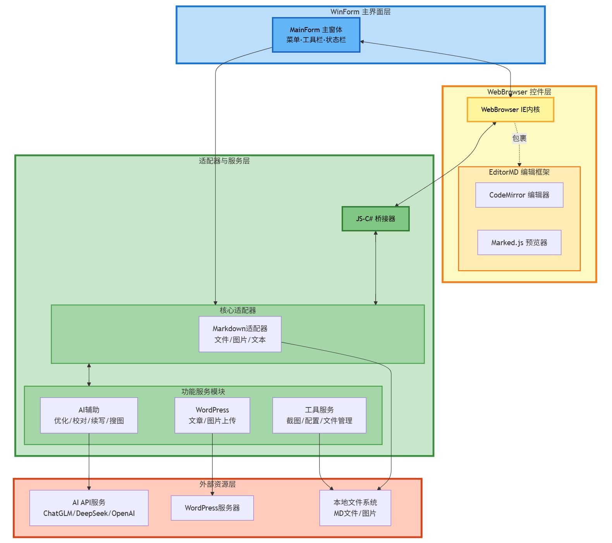
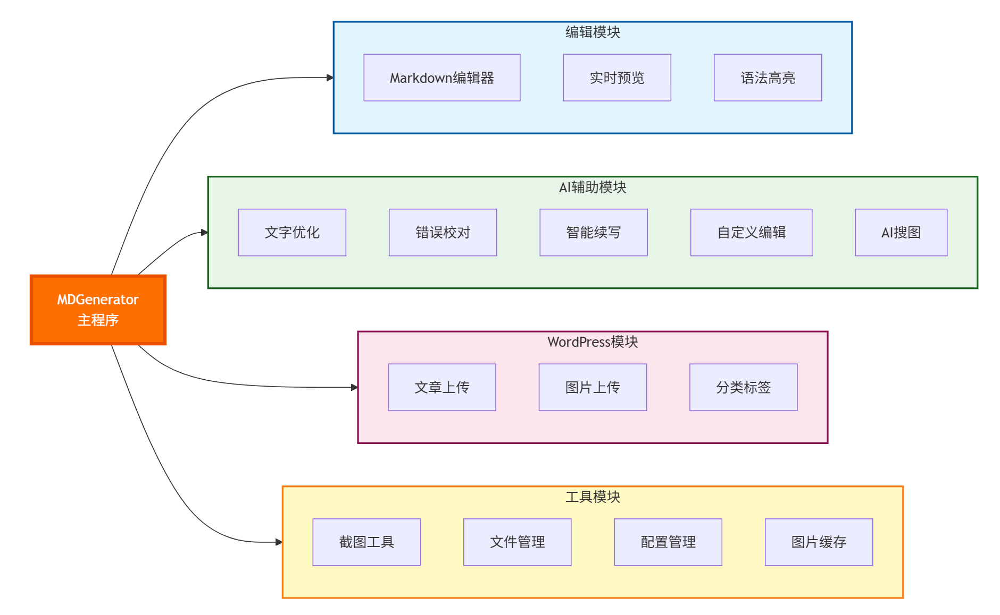
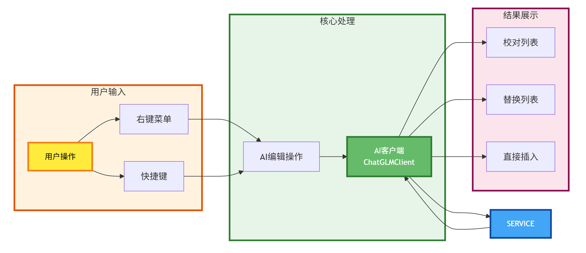
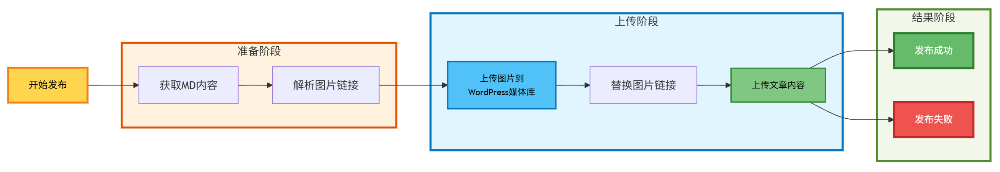
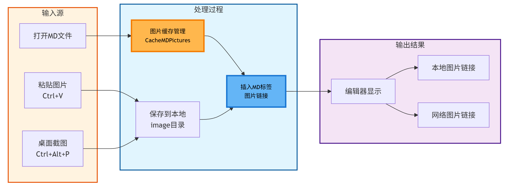
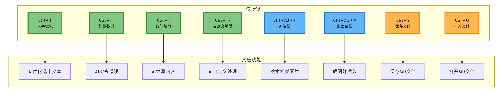
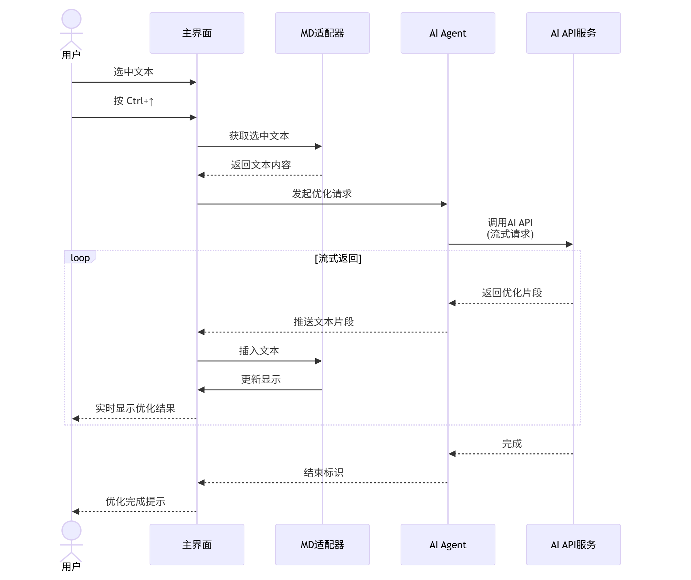
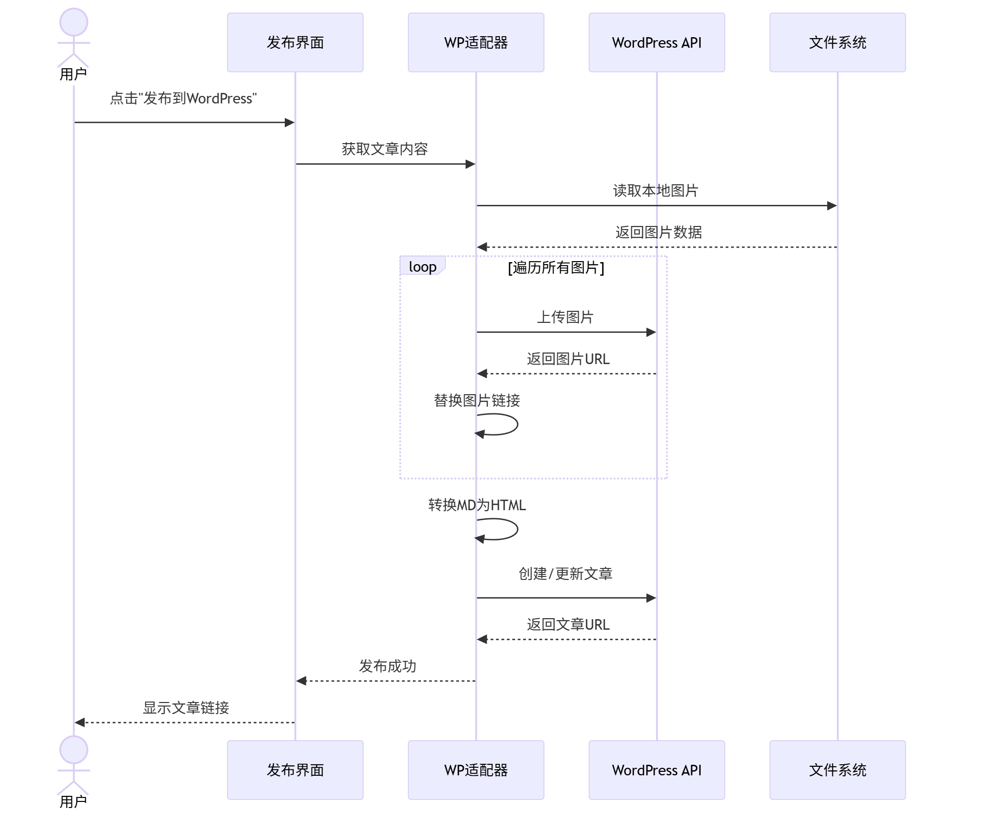
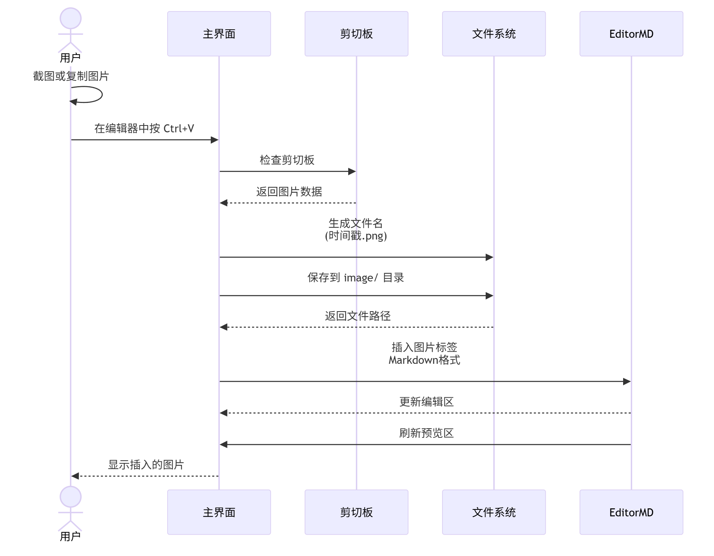

# MDGenerator 产品设计文档

> [English Version (英文版本)](./design_en.md)

## 产品概述

**MDGenerator** 是一款功能强大的 Markdown 编辑器，集成了AI辅助写作、WordPress自动发布、图片管理等功能，旨在为用户提供高效便捷的文档创作体验。

**当前版本：** V0.9

## 设计原理

EditorMD是一款非常便捷的基于html+JS的md编辑器框架，我们通过Windows内置的Webbrowser对其进行包裹和自动化控制，将这个编辑器框架进行了Winform平台化封装。具体分为以下几个步骤：

1. 根据Webbrowser的最小运行环境需求对.net平台内置的IE浏览器进行深度定制，使其同时兼容Windows7、Windows10和Windows11。
2. 通过在JS层和C#层分别编写适配代码完成C#代码与EditorMD的基本数据交换，实现Winform桌面程序代码对Web框架的遥控。
3. 编写适配器，对需要与EditorMD进行交互的功能进行包裹，如提取图片信息、交换图片链接地址、代码区和预览区的数据同步等。
4. 集成WordPress REST API实现文章和图片的自动上传发布功能。
5. 集成OpenAI兼容的AI Agent接口，提供智能写作辅助功能。

## 代码设计

MDGenerator基于广泛应用的开源MD框架工具EditorMD，并在此基础上进行二次开发。程序分为用户UI层与框架适配层，二者基本分离。程序代码力求以最小的代码量实现所需要的功能，同时保持良好的可扩展性。

### 核心功能模块

1. **Markdown编辑核心**
   - 基于EditorMD的双栏编辑与实时预览
   - 支持全部MD标准语法及扩展语法
   - 剪切板图片自动固化功能

2. **AI辅助写作模块** (V0.9新增)
   - AI文字优化与润色
   - AI错误检查与校对
   - AI智能续写
   - AI自定义编辑
   - AI智能搜图
   - 支持OpenAI兼容的多种AI模型

3. **WordPress集成模块**
   - 文章自动上传到WordPress
   - 图片自动上传到WordPress媒体库
   - 支持WordPress REST API认证
   - 文章分类、标签、特色图片管理

4. **图片管理模块**
   - 本地图片缓存机制
   - 桌面截图功能（可自定义缩放比例）
   - 图片链接本地/网络模式切换
   - 图片批量上传管理

5. **用户界面模块**
   - 可自定义字体大小
   - 可调节缩放比例
   - 右键菜单快捷操作
   - 文件拖拽支持

### 系统架构示意图

#### 1. 整体架构图

**分层说明：**

- **第1层 - WinForm主界面层（蓝色）**
  - MainForm主窗体提供用户交互界面
  - 包含菜单栏、工具栏、状态栏等UI元素

- **第2层 - WebBrowser控件层（黄色）**
  - WebBrowser控件承载IE内核浏览器
  - 内嵌EditorMD Web框架
  - CodeMirror提供编辑功能，Marked.js提供预览渲染

- **第3层 - 适配器与服务层（绿色）**
  - **JS-C#桥接器**：实现JavaScript与C#的双向通信
  - **Markdown适配器**：处理文件、图片、文本操作
  - **AI辅助模块**：文字优化、错误校对、智能续写、AI搜图
  - **WordPress模块**：文章和图片自动上传
  - **工具服务**：截图、配置管理、文件管理

- **第4层 - 外部资源层（橙色）**
  - AI API服务（ChatGLM、DeepSeek、OpenAI等）
  - WordPress服务器
  - 本地文件系统

#### 2. 核心功能模块组成

#### 3. AI服务模块详细架构

#### 4. WordPress发布流程架构

#### 5. 文件与图片处理流程

#### 6. 快捷键操作映射

**架构说明：**

- **图1 - 整体分层架构**：展示5层架构，清晰的从上到下的数据流向
- **图2 - 核心功能模块**：展示4大功能模块（编辑/AI/WordPress/工具）的组成结构
- **图3 - AI服务模块**：展示AI功能的完整调用链路，从用户操作到API调用
- **图4 - WordPress发布**：展示从准备阶段到发布完成的完整流程
- **图5 - 文件图片处理**：展示各种图片输入源的处理流程和输出形式
- **图6 - 快捷键映射**：展示所有快捷键与功能的一一对应关系

### 主要操作流程时序图

#### 1. AI文字优化流程

#### 2. WordPress文章发布流程

#### 3. 图片粘贴与插入流程

### 源代码目录结构：
* MDLoader
	* MDLoader.csproj - C#项目文件
	* MainForm/
		* Form1.cs - 主窗体
	* Markdown/
		* Adapter.cs - EditorMD 框架适配器
	* Tool/
		* MFiles.cs - 本地目录文件操作
		* setup.cs - 配置管理器
		* BaiduBrowser.cs - 图片搜索浏览器
	* WordPress/
		* WordPressAPI.cs - WordPress REST API封装
		* WordPressForm.cs - WordPress上传界面
		* WpAdapter.cs - WordPress适配器
		* WordPressHelper.cs - WordPress辅助工具
	* AIForms/
		* agent.cs - AI Agent核心客户端
		* AIOnEditorOperation.cs - AI编辑器操作
		* AICheckListForm.cs - AI校对列表界面
		* AIReplaceListForm.cs - AI替换列表界面
		* ItemCheckPanel.cs - 校对项面板
		* ItemReplacePanel.cs - 替换项面板
	* version.txt - 版本更新记录
	* bin/ - 发布版本

### 程序运行功能模块介绍

1. **准备程序运行环境（Program.cs）**
	- 解析传入的参数
	- 通过编辑注册表调整默认的IE运行环境
	- 通过时间戳定义缓存目录名
	- 错误信息归集化处理

2. **与用户进行命令交互（Form1.cs）**
	- 建立一个WebBrowser的运行环境，进行必要的初始化
	- 加载Editor.md运行框架
	- 框架加载成功后加载用户Markdown文件
		- 缓存图片文件到本地
		- 将Markdown文件加载到Adapter
		- 刷新WebBrowser，使文件呈现出来
	- 调用Adapter对象中的方法响应用户事件
		- 打开文件
			- LoadMDFile 方法
			- CacheMDPictures 方法
			- SetUserSideMD 方法
		- 新建文件
			- Clear 方法
		- 保存文件
			- SaveFile 方法
		- 另存文件
			- 同上
		- 同步Markdown的工作区大小
			- SetClientSize JS方法
		- 同步用户输入，并刷新图片缓存
			- GetUserSideMD 方法
			- CacheMDPictures 方法
		- 响应用户Ctrl+V操作
			- 将剪切板保存为image目录下的文件，PNG格式
			- 将新的图片Markdown标签插入到用户编辑区
		- 处理用户拖拽文件到应用，及超链被点击后的操作
			- 通过Navigating函数读取拖入文件，或者超链点击的文件的路径
			- 根据文件类型，执行操作
				- 首次打开MD文件，则在本窗口打开
				- 二次以上打开MD文件，重新启动本程序的多个副本打开
				- 如果是其他类型文件，调用OS的Shell程序执行
		- 上传文章到WordPress服务器
			- WordPressForm对象调用
			- 自动上传文章内容和图片
		- 本地图片路径与服务器图片路径的切换
			- SwitchPicture 方法
		- AI辅助写作功能（V0.9新增）
			- AI文字优化 - 对选中文本进行润色优化
			- AI查错 - 智能检查文本错误并给出建议
			- AI续写 - 根据上下文智能续写内容
			- AI自定义编辑 - 根据用户指令编辑文本
			- AI搜图 - 智能搜索相关图片
		- 桌面截图功能（V0.9新增）
			- 支持自定义缩放比例
			- 自动保存到image目录
			- 自动插入Markdown图片标签
		- 保存用户配置
			- SetupForm对象调用

3. **Editor.md适配器（Adapter.cs）**
	- `public List<string> CacheMDPictures(string fileName)`
		- 加载Markdown文件中描述的图片到本地
		- 每次加载前会比对前次缓冲的目录，仅当缓冲区图片发生变化时重新加载图片缓存
	- `LoadMDFile(string fileName, WebBrowser browser)`
		- 加载MD文件到Adapter
	- `public bool SaveFile(string file)`
		- 保存文件到指定目录
	- `public void Clear(WebBrowser browser)`
		- 清空Adapter中的Markdown文本，并刷新到浏览器
	- `public void GetUserSideMD(WebBrowser browser)`
		- 从Editor.md重新加载MD文本到Adapter，防止用户编辑没有被及时更新
	- `public void SetUserSideMD(WebBrowser browser)`
		- 把更新过的MD内容加载到用户编辑器
	- `public void SwitchPicture(WebBrowser browser, Picture_mode type)`
		- 切换MD文本中的图片地址，本地图片与网络图片互相切换
	- `public bool GetIfModified()`
		- 判断距离上次保存有没有修改过Markdown文本内容
	- `public string GetSelectedText(WebBrowser browser)` (V0.9新增)
		- 获取编辑器中选中的文本
	- `public string GetTextBeforeSelection(WebBrowser browser)` (V0.9新增)
		- 获取选中文本之前的内容
	- `public void InsertText(WebBrowser browser, string text)` (V0.9新增)
		- 在当前光标位置插入文本

4. **WordPress集成模块（WordPress/）** (V0.8新增)
	- `WordPressAPI.cs` - WordPress REST API核心功能
		- `UploadImageFile()` - 上传图片到WordPress媒体库
		- `CreatePost()` - 创建新文章
		- `UpdatePost()` - 更新文章
		- `GetCategories()` - 获取分类列表
		- `GetTags()` - 获取标签列表
	- `WordPressForm.cs` - WordPress上传界面
		- 文章标题、分类、标签设置
		- 特色图片上传
		- 发布状态管理
	- `WpAdapter.cs` - WordPress与Markdown的转换适配
		- Markdown转HTML
		- 图片链接替换
		- 元数据处理

5. **AI辅助写作模块（AIForms/）** (V0.9新增)
	- `agent.cs` - ChatGLMClient AI客户端核心
		- 支持OpenAI兼容接口
		- 流式响应处理
		- 上下文管理
		- 支持自定义AI模型和API地址
	- `AIOnEditorOperation.cs` - AI编辑器操作实现
		- `AIContinue()` - AI续写功能
		- `AICustomizedModify()` - AI自定义编辑
		- `AIOptimize()` - AI文字优化
		- `AICheck()` - AI校对检查
	- `AICheckListForm.cs` - AI校对结果列表界面
		- 显示所有校对建议
		- 支持逐项查看和应用修改
	- `AIReplaceListForm.cs` - AI替换建议列表界面
		- 显示优化后的文本对比
		- 支持选择性应用修改
	- `ItemCheckPanel.cs` / `ItemReplacePanel.cs` - 检查/替换项UI面板
		- 单项校对/替换内容显示
		- 交互式操作支持

6. **浏览器环境模拟器配置（SetWebbrowser.cs）**
	- `ChangeWebbrowserMode(int ieMode)`
		- 修改WebBrowser控件模拟的IE版本

7. **配置管理器（setup.cs）** (持续更新)
	- WordPress配置
		- 服务器地址、用户名、应用密码
	- AI配置 (V0.9新增)
		- AI API Key
		- AI API地址（支持OpenAI兼容接口）
		- AI模型选择
	- 界面配置
		- 字体大小
		- 缩放比例
		- 截图缩放比例 (V0.9新增)
	- 编辑器配置
		- 默认保存路径
		- 图片缓存路径

8. **图片搜索浏览器（BaiduBrowser.cs）** (V0.9新增)
	- 集成在线图片搜索
	- 图片预览和下载
	- 自动插入到Markdown文档

## 技术特点

1. **跨平台兼容性**
   - 支持Windows 7/10/11
   - 自动适配不同DPI缩放比例
   - 兼容性注册表配置

2. **AI集成架构**
   - 标准OpenAI API兼容接口
   - 支持多种AI模型（ChatGLM、DeepSeek等）
   - 异步流式响应处理
   - 可配置的AI参数

3. **WordPress集成**
   - 基于REST API v2
   - 安全的应用密码认证
   - 自动图片上传和链接替换
   - 完整的文章元数据支持

4. **模块化设计**
   - 清晰的功能模块划分
   - 松耦合的架构设计
   - 易于扩展和维护

## 版本演进

- V0.9 (当前版本)
  - 增加AI辅助写作功能
  - 增加AI搜图功能
  - 增加AI校对功能
  - 增加桌面截图功能
  - 新增一系列辅助写作的右键菜单功能

- V0.8
  - 删除FTP上传功能，改为WordPress上传功能
  - 增加上传文章到WordPress服务器的功能
  - 增加自由调节菜单栏编辑栏字体大小的功能
  - 修正文字放大缩小后布局错乱的问题

- V0.6
  - 修正无法打开超链的问题
  - 优化解决间歇性文件无法显示的问题
  - 支持文件拖拽打开
  - Win11环境测试通过
  - 发行版增加Loader，便于在线升级

## 未来规划

1. 支持更多AI模型和提供商
2. 增强WordPress集成功能（草稿同步、离线编辑等）
3. 支持更多图床服务
4. 增加插件系统，支持第三方扩展
5. 云端同步功能
6. 多语言国际化支持

## 开发说明

本项目采用MIT协议开源，欢迎贡献代码和提出建议。

5. 运行环境配置 (Setup.cs)
	- SetupForm()
从config.xml中加载配置到Config对象
	- public void MoveSplitterTo(PropertyGrid grid, int x)
调整栏目宽度，由于这个方法本身的propertygrid没有公有方法支持，所以需要用反射技术调用私有方法实现
	- 保存
保存配置到config.xml,并重启
	- 读取
读取文件到config
6. 版本信息 (version.txt)
记录版本信息

更详细的请直接阅读源码中的说明, 如果您在阅读代码时发生疑问欢迎与我取得联系，QQ:64034373 好友申请注明MDFileLoader，由于水平有限，bug在所难免，欢迎提交bug，对于有重要贡献的小伙伴将加入contributor列表。
