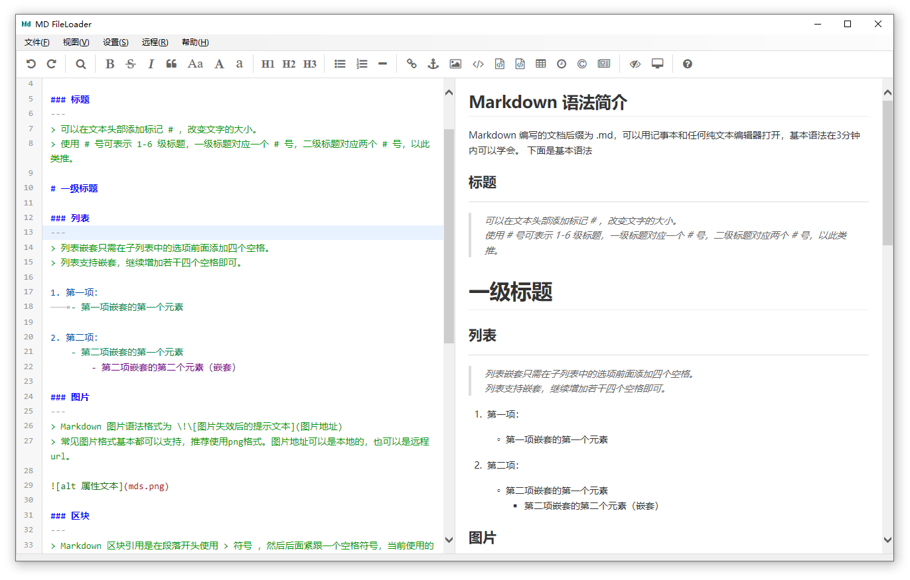

# MDGenerator - Intelligent Markdown Editor

> [中文版本 (Chinese Version)](./readme.md)

## Features

**MDGenerator** is a fully open-source minimalist Markdown editor that supports all MD standard syntax as well as common MD extended syntax, such as videos, HTML elements, etc. We aim to provide support for offline editing, AI-assisted creation, and online publishing of MD files with a minimal environment, reducing the workload of online document writing.



## Core Features

### Basic Editing Features
1. **Dual-Pane Editing Mode** - Provides real-time Markdown file editing and preview
2. **Automatic Clipboard Image Solidification** - Can directly add to documents via Ctrl+V shortcut and automatically generate local files
3. **File Drag-and-Drop Support** - Supports drag-and-drop opening of Markdown files
4. **Customizable Interface** - Supports freely adjustable menu bar, edit bar font size, and zoom ratio

### AI-Assisted Writing Features ⭐ (V0.9 New)
5. **AI Text Optimization** (Ctrl+↑) - Intelligently polish and optimize selected text to improve article quality
6. **AI Intelligent Error Checking** (Ctrl+←) - Automatically check grammar, spelling, and logic errors, provide modification suggestions
7. **AI Intelligent Continuation** (Ctrl+↓) - Intelligently continue content based on context, maintain consistent language style
8. **AI Custom Editing** (Ctrl+→) - Edit text according to your custom instructions
9. **AI Intelligent Image Search** (Ctrl+Alt+F) - AI-assisted search for relevant images, quick illustration

> **Supports Multiple AI Models**: Compatible with OpenAI API standard interface, supports ChatGLM, DeepSeek, OpenAI, and other AI services

### WordPress Integration Features (V0.8 New)
10. **One-Click Article Publishing** - Automatically convert and upload Markdown articles to WordPress
11. **Automatic Image Upload** - Images in articles are automatically uploaded to WordPress media library with replaced links
12. **Complete Metadata Support** - Supports article categories, tags, featured images, and other settings

### Image Management Features
13. **Desktop Screenshot** (Ctrl+Alt+V) - Supports desktop screenshots and automatic insertion into documents, customizable scaling ratio
14. **Image Link Switching** - One-click switching between local image and network image links

MDGenerator is released under the MIT license with fully open source code. You are welcome to use or develop it further.

## Version Information

### V0.9 (Current Version) - January 2026
**AI-Assisted Writing Comprehensive Upgrade**
1. ✨ Added AI-assisted writing features
   - AI text optimization (Ctrl+↑)
   - AI error checking and proofreading (Ctrl+←)
   - AI intelligent continuation (Ctrl+↓)
   - AI custom editing (Ctrl+→)
2. 🖼️ Added AI intelligent image search feature (Ctrl+Alt+F)
3. 📸 Added desktop screenshot feature (Ctrl+Alt+V), supports customizable scaling ratio
4. 🎯 Added series of writing-assistance right-click menu features
5. 🔧 Supports multiple OpenAI-compatible AI model interfaces

### V0.81
- Fixed issue where article upload failed when there were no images

### V0.8 - WordPress Integration
**Major Feature Updates**
1. Removed FTP upload function, replaced with WordPress upload
2. Added article upload to WordPress server
3. Added freely adjustable menu bar and edit bar font size
4. Fixed layout disorder issue after text zoom

### V0.6 - Stability Improvement
**A Major Version Upgrade**
1. Fixed hyperlink opening issue
2. Optimized solution for intermittent file display failure with ineffective refresh
3. Supports file drag-and-drop opening
4. Preliminary testing passed in Win11 environment
5. Release version added Loader for online updates
6. Reorganized code order to increase readability, improved documentation

### V0.44
- Changed target registry tree so IE version setting registry operations no longer require administrator privileges

### V0.43
- Added file save check when exiting

### V0.41
- Modified underlying MD generator source code to add random suffix to images, fixed image X issue, but CPU usage increased

### V0.4
- Added MD syntax introduction and set as default display on startup

### V0.33
- Fixed error where program threw exceptions when Win10 scaling was 150%

### V0.32b - First Public Test Version
- First official test release, tested on Win7, Win10, 64-bit environments

## Quick Start

### Installation and Configuration

1. **Download and Install**
   - Download the latest version of MDGenerator
   - Extract to any directory
   - Run `MDGenerator.exe`

2. **Configure AI Features** (Optional)
   - Open `Settings` → `System Settings`
   - Configure AI API Key and API address
   - Supports the following AI services:
     - ChatGLM (default)
     - DeepSeek
     - OpenAI
     - Other OpenAI-compatible interfaces

3. **Configure WordPress** (Optional)
   - Open `Settings` → `System Settings`
   - Enter WordPress site address
   - Enter username and application password
   - Application password retrieval: WordPress backend → Users → Profile → Application Passwords

### User Guide

#### Basic Editing
- **New File**: File → New (Ctrl+N)
- **Open File**: File → Open (Ctrl+O), or directly drag MD file to window
- **Save File**: File → Save (Ctrl+S)
- **Paste Image**: Directly press Ctrl+V in edit area to paste clipboard image

#### AI-Assisted Writing
1. **Text Optimization**
   - Select text to optimize
   - Press `Ctrl+↑` or right-click menu select "AI Text Optimization"
   - AI will polish and optimize the text

2. **Intelligent Error Checking**
   - Select text to proofread
   - Press `Ctrl+←` or right-click menu select "AI Error Check"
   - View AI-provided error and suggestion list
   - Review and apply modifications item by item

3. **Intelligent Continuation**
   - Place cursor at position to continue
   - Press `Ctrl+↓` or right-click menu select "AI Continuation"
   - AI will automatically continue content based on context

4. **Custom Editing**
   - Select text to edit
   - Press `Ctrl+→` or right-click menu select "AI Custom Editing"
   - Enter your editing requirements (e.g., "change to formal tone", "translate to English", etc.)
   - AI will edit text according to your requirements

5. **AI Image Search**
   - Press `Ctrl+Alt+F` or right-click menu select "AI Image Search"
   - Enter image keywords
   - Select appropriate image to automatically insert into document

#### WordPress Publishing
1. Click "Upload to WordPress" button in toolbar
2. Set article title, categories, tags
3. Select featured image (optional)
4. Click "Publish"
5. Article and images will be automatically uploaded to WordPress

#### Screenshot Feature
- Press `Ctrl+Alt+V` to start screenshot
- Select screenshot area
- Screenshot will be automatically saved and inserted into document
- Can adjust screenshot scaling ratio in settings

## System Requirements

- **Operating System**: Windows 7 / 8 / 10 / 11
- **.NET Framework**: 4.5 or higher
- **Network Connection**: Required when using AI features and WordPress publishing
- **Screen Resolution**: Recommended 1920x1080 or higher

## Technical Architecture

### Core Principles
EditorMD is a very convenient Markdown editor framework based on HTML+JS. We wrap and automate it through the Windows built-in WebBrowser control, encapsulating this editor framework for the platform.

### Implementation Steps

1. **Browser Environment Customization**
   - Deeply customize the IE browser built into the .NET platform according to WebBrowser's minimum runtime environment requirements
   - Compatible with Windows 7, Windows 10, and Windows 11

2. **Bidirectional Data Exchange**
   - Write adapter code in both JS layer and C# layer
   - Complete basic data exchange between C# code and EditorMD
   - Implement remote control of Web framework from program code

3. **Function Adapter Encapsulation**
   - Write adapters to wrap functions that need to interact with EditorMD
   - Such as extracting image information, exchanging image link addresses, synchronizing data between code area and preview area

4. **WordPress Integration**
   - Automatically upload articles and images to WordPress server through WordPress REST API
   - Supports complete article metadata management

5. **AI Capability Integration**
   - Integrate OpenAI-compatible AI Agent interface
   - Provide intelligent writing assistance
   - Support streaming responses and context management

### Project Structure
```
MDGenerator/
├── Program/MDGenerator/
│   ├── MainForm/          # Main form and UI
│   ├── Markdown/          # Markdown adapter
│   ├── WordPress/         # WordPress integration module
│   ├── AIForms/          # AI-assisted writing module
│   ├── Tool/             # Utility classes and configuration
│   └── Properties/       # Project properties
├── bin_Release/          # Release version
└── editormd/            # EditorMD framework
```

For detailed design documentation, please refer to [MDGenerator Design Document](./design_en.md)

### Development Environment
- Visual Studio 2019 or higher
- .NET Framework 4.5+

## License

This project is released under the **MIT License**.

You are free to use, modify, and distribute this software.

## Contributors

Fantasy, AndyVane, 梦程

---

**Enjoy intelligent writing, let AI empower your creation!** ✨
